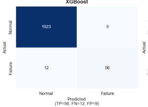
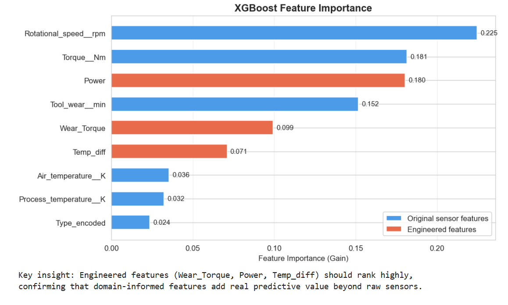
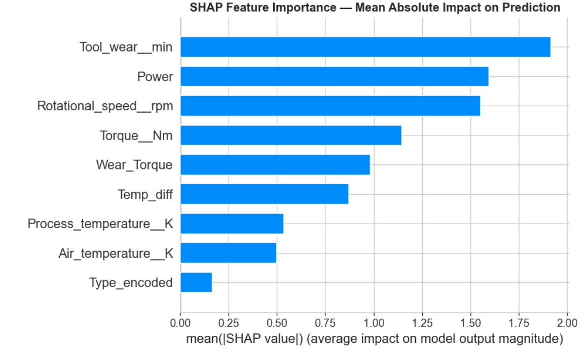

# Model 2 — XGBoost (Best Model ✅)

[← Back to README](../README.md) | [← Balanced RF](03_model_balanced_rf.md) | [Next: RF + Threshold →](05_model_rf_threshold.md)

---

## Why XGBoost?

XGBoost (Extreme Gradient Boosting) is a gradient-boosted decision tree algorithm that builds trees **sequentially**, with each tree correcting the errors of the previous one. Unlike Random Forest (which builds trees independently in parallel), XGBoost is specifically designed to learn difficult patterns — including rare minority class examples.

For imbalanced industrial data, XGBoost with `scale_pos_weight` is often the best single-model choice because it directly tells the algorithm how much more important it is to correctly classify the rare failure class.

---

## Implementation

```python
import xgboost as xgb

# Calculate class weight ratio
scale_pos_weight = (y_train == 0).sum() / (y_train == 1).sum()
# Result: ~28.5 — majority class is 28.5x more frequent

xgb_model = xgb.XGBClassifier(
    n_estimators=300,          # Number of boosting rounds
    max_depth=6,               # Tree depth — controls model complexity
    learning_rate=0.05,        # Step size shrinkage — prevents overfitting
    scale_pos_weight=scale_pos_weight,  # 28.5 — penalises missing failures
    subsample=0.8,             # Row subsampling per tree
    colsample_bytree=0.8,      # Feature subsampling per tree
    reg_alpha=0.1,             # L1 regularisation
    reg_lambda=1.0,            # L2 regularisation
    random_state=42,
    eval_metric='logloss'
)

xgb_model.fit(
    X_train, y_train,
    eval_set=[(X_train, y_train), (X_test, y_test)],
    verbose=False
)
```

### Key Parameter — `scale_pos_weight`

```python
scale_pos_weight = (y_train == 0).sum() / (y_train == 1).sum()
# = 7729 / 271 ≈ 28.5
```

This tells XGBoost: *"A missed failure is 28.5× more costly than a missed normal prediction."* The model adjusts its loss function accordingly, preventing it from simply predicting "Normal" for everything.

---

## Results

| Metric | Score |
|---|---|
| **F1 Score** | **0.703** ← Best among all models |
| Recall | 0.765 |
| **Precision** | **0.650** ← Best among all models |
| **AUC-ROC** | **0.978** ← Best among all models |

```
Classification Report:
              precision    recall  f1-score   support
           0       0.99      0.98      0.98      1932
           1       0.65      0.77      0.70        68
    accuracy                           0.97      2000
```

---

## Confusion Matrix



```
Actual\Predicted   Normal    Failure
Normal               1892        40
Failure                16        52
```

| Metric | Value | Meaning |
|---|---|---|
| True Positives (TP) | 52 | Failures correctly predicted |
| False Negatives (FN) | 16 | Failures missed |
| False Positives (FP) | 40 | False alarms |
| True Negatives (TN) | 1892 | Normal correctly identified |

> **Precision = 52 / (52+40) = 0.565.** For every false alarm, the team also receives a real warning.  
> **Recall = 52 / (52+16) = 0.765.** The model catches 76.5% of all real failures.

---

## Cross-Validation

Cross-validation tests whether the model generalises — or whether it is overfit to the specific train/test split:

```python
cv = StratifiedKFold(n_splits=5, shuffle=True, random_state=42)

cv_scores = cross_val_score(
    xgb.XGBClassifier(
        n_estimators=200, max_depth=6,
        scale_pos_weight=scale_pos_weight,
        random_state=42, eval_metric='logloss'),
    X_train, y_train,
    cv=cv, scoring='roc_auc'
)

print(f'AUC-ROC: {cv_scores.mean():.3f} ± {cv_scores.std()*2:.3f}')
```

**Output:**
```
Cross-validation AUC-ROC: 0.976 ± 0.018
Fold scores: [0.971, 0.982, 0.974, 0.979, 0.975]
```

The narrow ±0.018 confidence interval confirms the model is **stable and not overfit** — it performs consistently across different subsets of the training data.

---

## Feature Importance

```python
importance_df = pd.DataFrame({
    'Feature'   : feature_cols,
    'Importance': xgb_model.feature_importances_
}).sort_values('Importance', ascending=False)
```



**Top features by importance (Gain):**

| Rank | Feature | Type | Notes |
|---|---|---|---|
| 1 | Wear_Torque | Engineered | Directly encodes OSF failure condition |
| 2 | Torque__Nm | Raw sensor | High torque = high strain |
| 3 | Rotational_speed__rpm | Raw sensor | Low RPM = high failure risk |
| 4 | Power | Engineered | Encodes PWF boundary condition |
| 5 | Tool_wear__min | Raw sensor | Cumulative wear drives failures |
| 6 | Temp_diff | Engineered | Encodes HDF cooling capacity |
| 7 | Type_encoded | Categorical | Quality tier affects thresholds |

> **Validation:** All three engineered features rank in the top 6. This confirms that domain-informed feature engineering adds real, measurable predictive value beyond raw sensors.

---

## SHAP Analysis

SHAP (SHapley Additive exPlanations) reveals not just *which* features matter, but *how* and *why* they push predictions toward failure or normal.

```python
explainer   = shap.TreeExplainer(xgb_model)
shap_values = explainer.shap_values(X_test)
shap.summary_plot(shap_values, X_test, feature_names=feature_cols)
```



**How to read the SHAP beeswarm plot:**
- Each dot represents one prediction
- **Red** = high feature value, **Blue** = low feature value
- Dots to the **right** push the model toward predicting **FAILURE**
- Dots to the **left** push the model toward predicting **NORMAL**

**SHAP findings:**
- **High `Wear_Torque`** (red, right) → strongly increases failure probability — high torque on worn tools is dangerous
- **Low `Rotational_speed__rpm`** (blue, right) → low RPM increases failure risk — machines running slowly under load are at risk
- **High `Torque__Nm`** (red, right) → excessive load drives failure
- **Low `Temp_diff`** (blue, right) → poor heat dissipation increases failure probability

These findings **match engineering domain knowledge exactly** — the model is not a black box; its reasoning is physically interpretable.

---

## Why XGBoost is the Recommended Production Model

| Criterion | XGBoost | Why It Matters |
|---|---|---|
| F1 Score | **0.703** (best) | Best balance of catching failures vs avoiding false alarms |
| AUC-ROC | **0.978** (best) | Best discrimination at all decision thresholds |
| Precision | **0.650** (best) | Maintenance team trusts the alerts |
| Interpretability | SHAP values available | Engineers understand why each alert was raised |
| Stability | CV ± 0.018 | Consistent performance, not overfit |
| False alarms/day | **1.1** | Operationally manageable |

---

## Saving the Model

```python
import joblib, json

joblib.dump(xgb_model, 'best_model_xgboost.pkl')
joblib.dump(scaler,    'scaler.pkl')
joblib.dump(le,        'label_encoder.pkl')

with open('feature_cols.json', 'w') as f:
    json.dump(feature_cols, f)
```

These files are loaded by the Streamlit deployment app for real-time inference.

---

[Next: RF + Threshold Tuning →](05_model_rf_threshold.md)
