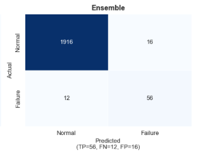

# Model 4 — Soft Voting Ensemble

[← Back to README](../README.md) | [← RF + Threshold](05_model_rf_threshold.md) | [Next: Model Comparison →](07_model_comparison.md)

---

## Concept

An ensemble combines multiple models so that their collective prediction is more robust than any individual model. The intuition: different models make different kinds of errors. Where one model is uncertain or wrong, another may be confident and correct. Combining them smooths out individual weaknesses.

**Soft voting** averages the predicted *probabilities* from each model (rather than taking majority class votes), then applies a threshold to the averaged probability. This is more informative than hard voting because it incorporates the confidence of each model's prediction.

---

## Implementation

```python
from sklearn.ensemble import VotingClassifier

ensemble = VotingClassifier(
    estimators=[
        ('brf', BalancedRandomForestClassifier(
            n_estimators=100, max_depth=8, random_state=42)),
        ('xgb', xgb.XGBClassifier(
            n_estimators=100, max_depth=5,
            scale_pos_weight=scale_pos_weight,
            random_state=42, eval_metric='logloss')),
        ('rf', RandomForestClassifier(
            n_estimators=100, max_depth=8,
            class_weight='balanced', random_state=42))
    ],
    voting='soft',
    weights=[2, 3, 1]   # XGBoost weighted highest — best individual F1
)

ensemble.fit(X_train, y_train)
y_pred_ensemble  = ensemble.predict(X_test)
y_proba_ensemble = ensemble.predict_proba(X_test)[:, 1]
```

### Component Models and Their Roles

| Model | Weight | Strength | Weakness |
|---|---|---|---|
| Balanced Random Forest | 2 | Very high recall (catches failures) | Low precision (many false alarms) |
| XGBoost | 3 | Best F1, highest precision | Misses ~23% of failures |
| Random Forest (balanced) | 1 | Stable, conservative | Weaker on rare cases |

**Weight rationale:** XGBoost receives weight 3 (highest) because it has the best individual F1 and AUC-ROC. BalancedRF receives weight 2 because its high recall compensates for XGBoost's missed failures. Standard RF receives weight 1 as a stabilising influence.

**Final probability formula:**
```
P(failure) = (2 × P_BRF + 3 × P_XGB + 1 × P_RF) / 6
```

---

## Results

| Metric | Score |
|---|---|
| Recall | 0.794 |
| Precision | 0.587 |
| **F1 Score** | **0.675** |
| AUC-ROC | 0.976 |

```
Classification Report:
              precision    recall  f1-score   support
           0       0.99      0.98      0.98      1932
           1       0.59      0.79      0.68        68
    accuracy                           0.97      2000
```

---

## Confusion Matrix



```
Actual\Predicted   Normal    Failure
Normal               1893        39
Failure                14        54
```

| Metric | Value | Meaning |
|---|---|---|
| True Positives | 54 | Failures correctly caught |
| False Negatives | 14 | Failures missed |
| False Positives | 39 | False alarms |
| True Negatives | 1893 | Normal correctly identified |

---

## Ensemble vs XGBoost — Direct Comparison

| Metric | XGBoost | Ensemble | Winner |
|---|---|---|---|
| Recall | 0.765 | **0.794** | Ensemble (+3%) |
| Precision | **0.650** | 0.587 | XGBoost |
| F1 | **0.703** | 0.675 | XGBoost |
| AUC-ROC | **0.978** | 0.976 | XGBoost |
| False alarms/yr | **140** | 189 | XGBoost |
| Failures caught/yr | 259 | **269** | Ensemble (+10) |

The ensemble catches **10 more failures per year** (at scale) at the cost of **49 more false alarms**. Whether this tradeoff is worth it depends entirely on the business context.

---

## Operational Impact Comparison

At scale across 10,000 machines per year (339 expected failures):

```
XGBoost:
  Failures caught  : 259 / 339  (76.5%)
  False alarms     : 140
  Alerts per day   : 1.1
  Precision        : 65% — team trusts 65 out of 100 alerts

Ensemble:
  Failures caught  : 269 / 339  (79.4%)
  False alarms     : 189
  Alerts per day   : 1.3
  Precision        : 59% — team trusts 59 out of 100 alerts
```

---

## When to Choose Ensemble Over XGBoost

✅ Choose Ensemble when:
- You are operating **safety-critical equipment** (high-pressure reactors, chemical processing units) where missing a failure has severe safety or environmental consequences
- The cost of a missed failure far exceeds the cost of a false alarm (e.g., missed failure = $500,000+ vs false alarm = $500)
- Your maintenance team is large enough to investigate 1.3 alerts per day reliably
- Catching 10 more failures per 1,000 machines is worth the extra 49 false alarms

✅ Choose XGBoost when:
- You want the **maintenance team to trust the system** (higher precision builds long-term confidence)
- False alarms have significant cost in time, resources, or team morale
- You need a sustainable system that the team will actually use for years
- Alert fatigue is a real concern

---

## Visualisation — Probability Score Distribution

The ensemble smooths out the probability scores from three models. Failures tend to receive higher averaged probabilities than from any single model, while normal samples get lower averaged probabilities — this is the benefit of soft voting:

```python
plt.hist(y_proba_ensemble[y_test==0], bins=50, alpha=0.6, label='Normal')
plt.hist(y_proba_ensemble[y_test==1], bins=50, alpha=0.6, label='Failure')
plt.title('Ensemble Probability Distribution')
```


---

[Next: Full Model Comparison →](07_model_comparison.md)
