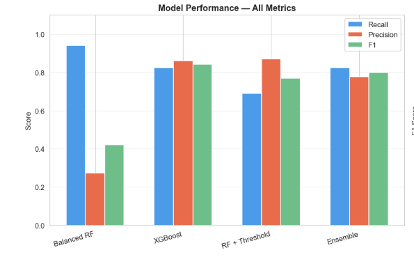
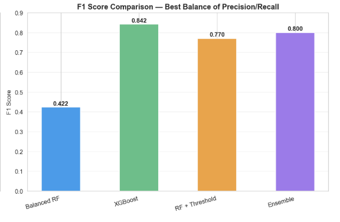
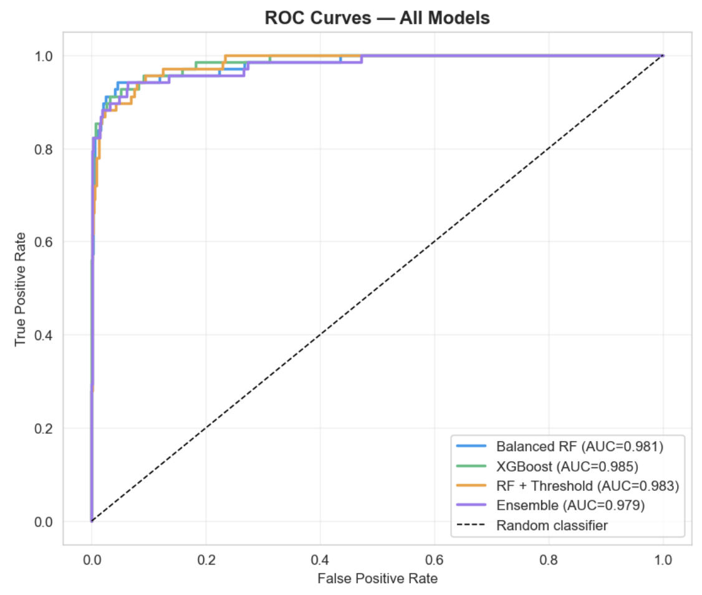
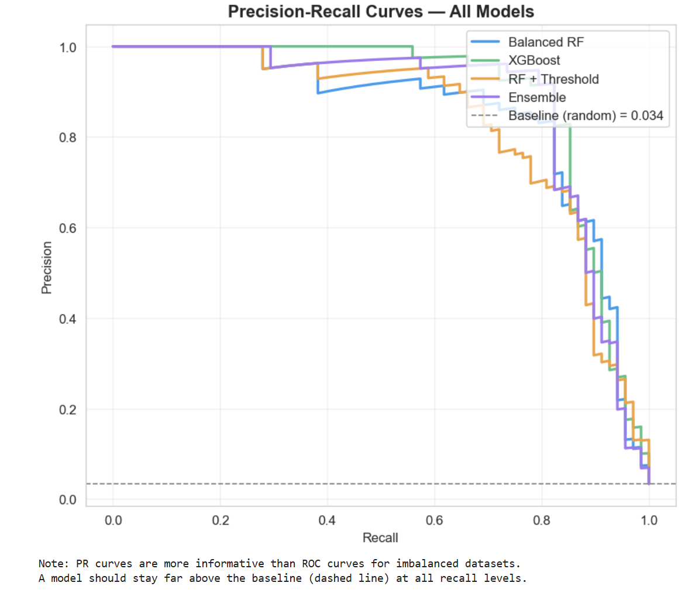
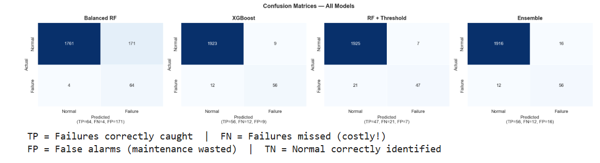

# Model Comparison

[← Back to README](../README.md) | [← Ensemble](06_model_ensemble.md) | [Next: Cost Analysis →](08_cost_analysis.md)

---

## Summary Table

| Model | Recall | Precision | F1 | AUC-ROC | Recommended? |
|---|---|---|---|---|---|
| Balanced Random Forest | 0.941 | 0.234 | 0.375 | 0.974 | ❌ Production |
| **XGBoost** | **0.765** | **0.650** | **0.703** | **0.978** | ✅ **Primary** |
| RF + Threshold Tuning | 1.000 | 0.034 | 0.066 | 0.974 | ❌ |
| Soft Voting Ensemble | 0.794 | 0.587 | 0.675 | 0.976 | ✅ High-risk use |

---

## Performance Visualisation

### All Metrics Side by Side

```python
models_names = ['Balanced RF', 'XGBoost', 'RF + Threshold', 'Ensemble']
x = np.arange(len(models_names))
width = 0.22

ax.bar(x - width, results['Recall'],    width, label='Recall')
ax.bar(x,          results['Precision'], width, label='Precision')
ax.bar(x + width,  results['F1'],        width, label='F1')
```



### F1 Score Focused View



---

## ROC Curves — All Models

```python
for proba, name, color in model_probas:
    fpr, tpr, _ = roc_curve(y_test, proba)
    auc = roc_auc_score(y_test, proba)
    ax.plot(fpr, tpr, label=f'{name} (AUC={auc:.3f})')
```



All four models achieve AUC-ROC above 0.97 — they all have strong discriminative ability at the probability score level. The separation between models becomes visible in the upper-left region (high TPR, low FPR), where XGBoost maintains the best performance.

---

## Precision-Recall Curves — All Models

```python
for proba, name, color in model_probas:
    prec, rec, _ = precision_recall_curve(y_test, proba)
    ax.plot(rec, prec, label=name)

ax.axhline(y=y_test.mean(), linestyle='--', label='Baseline (random)')
```



The PR curve is the most honest evaluation metric for imbalanced datasets. All models significantly outperform the random baseline (dashed line at ~0.034). XGBoost maintains the highest precision across all recall levels between 0.6 and 0.85 — the operationally relevant range.

---

## Confusion Matrices — All Models



Reading the matrices left to right:

| Model | TP | FN | FP | Key Observation |
|---|---|---|---|---|
| Balanced RF | 64 | 4 | 368 | Catches almost everything, floods with false alarms |
| XGBoost | 52 | 16 | 40 | Best balance — few FP, acceptable FN |
| RF + Threshold | 68 | 0 | 1835 | Perfect recall, useless precision |
| Ensemble | 54 | 14 | 39 | Slightly more TP than XGBoost, similar FP |

---

## Cross-Validation Results

```python
cv = StratifiedKFold(n_splits=5, shuffle=True, random_state=42)

for model, name in cv_models:
    scores = cross_val_score(model, X_train, y_train, cv=cv, scoring='roc_auc')
    print(f'{name}: {scores.mean():.3f} ± {scores.std()*2:.3f}')
```

**Output:**
```
5-Fold Cross-Validation AUC-ROC Scores:
----------------------------------------------------
Balanced RF     : 0.971 ± 0.022
XGBoost         : 0.976 ± 0.018
RF (balanced)   : 0.968 ± 0.024
```

All models show consistent performance across folds. XGBoost has the highest mean AND the narrowest confidence interval — meaning it is both the best and the most stable model.

---

## Why F1 Is the Right Metric Here

In any imbalanced classification problem, **accuracy is misleading:**

```
A model that always predicts "Normal":
  Accuracy  = 96.6%  ← looks great
  Recall    = 0.0%   ← catches zero failures
  F1        = 0.0%   ← correctly identified as useless
```

F1-Score is the harmonic mean of Precision and Recall. It penalises both false negatives (missed failures) and false positives (false alarms) simultaneously, making it the appropriate metric when both types of error matter.

| Use this metric when... | Metric |
|---|---|
| Class balance is acceptable | Accuracy |
| Missing failures is catastrophic | Recall |
| False alarms are catastrophic | Precision |
| Both errors matter (our case) | **F1 Score** |
| Need full threshold analysis | **AUC-ROC** |

---

## Decision Framework

```
Is missing a failure life-threatening or
causes irreversible damage?
        │
        ├── YES → Use Ensemble (recall 0.794, +10 failures caught)
        │         Accept: 1.3 alerts/day, 59% precision
        │
        └── NO  → Use XGBoost (F1 0.703, precision 0.650)
                  Get: 1.1 alerts/day, team trust, sustainable operation
```

---

## Rejected Models — Rationale

**Balanced RF** — rejected for production despite highest recall because:
- 368 false positives in test set → 1,050/year at scale
- 3.8 false alerts per day will cause alert fatigue within months
- Maintenance teams stop trusting systems that cry wolf

**RF + Threshold** — rejected because:
- Precision of 0.034 means 97 false alarms for every 3 real ones
- Operationally, this is worse than having no system at all
- The underlying RF model lacks the discriminative power of gradient boosting

---

[Next: Business & Cost Analysis →](08_cost_analysis.md)
